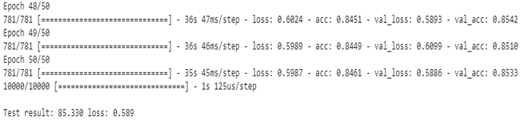
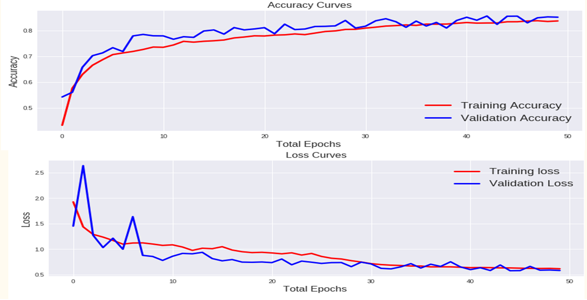
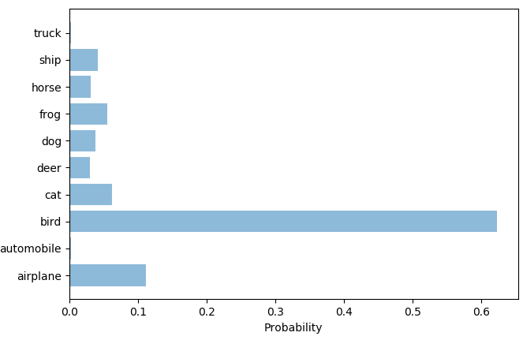
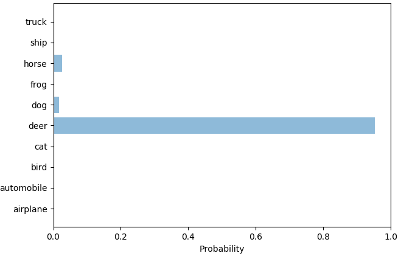
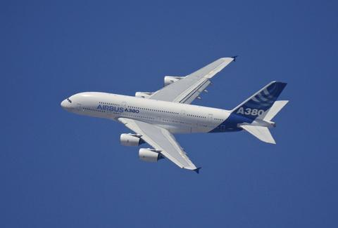
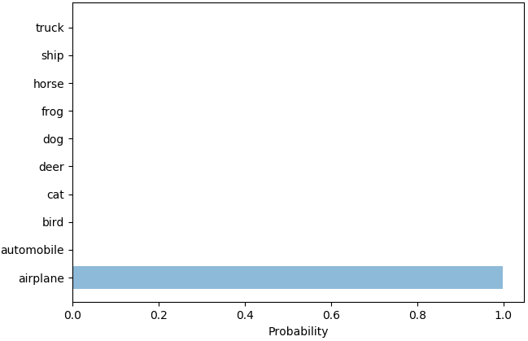

# Object-Detection-using-Convolutional-Neural-Network

The problem that we address is focused on intra-class variation (e.g. being able to
recognize any member of the “airplane” class or the “automobile” class). Data redundancy is the major problem
faced where variety of objects of the same category are widespread and are difficult to handle and
manipulate particular type of object from a pool of dataset. The project therefore, provides a solution to
interpret the object of particular class and detect it from the set of images.

## CIFAR-10
The model used is a Convolutional Neural Network which after 50 epochs of training gives approximately 85% training accuracy.

## Hardware Requirement : 
*	Processor: Intel® Core™ i5 processor 4300M at 2.60 GHz or 2.59 GHz 
*	Operating System: Windows 10 
*	RAM: 8GB 
*	Disk Space: 2 to 3 GB 
*	GPU is preferred 

## Software/ Libraries :
*	Language: Python 3.6 
*	IDE: IDLE/Spyder/PyCharm(for python programming), Ananconda prompt (Python 3.6), Google Colaboratory .
*	External libraries : numpy-Scientific computing and graph, matplotlib, open cv2 (required to recognize the images), scipy, sklearn-Machine learning and statistical algorithms and computation, tkinter- GUI, keras framework.

## Steps to run the project :

### Step 1 : Downloading Cifar10 dataset, training neural net, testing
1) Open Google colaboratory by logging into gmail account
https://colab.research.google.com/notebooks/welcome.ipynb
2) Open new notebook and run the code in `model.py` file in different cells.
3) Cifar10 dataset is downloaded,trained and tested showing training and validation: accuracy and loss graphs

4) On completely running the file model.py in Google Colab, two files are downloaded- `mytrainedmodel_arch.json` and `mytrainedmodel_weights.h5` which are later used in the file obj_detect.py as inputs.
5) Here, I have already trained the model and downloaded these files.

### Step 2 : Image detection and prediction, GUI
1) Open Anaconda Prompt(python 3.6) and change the directory to the above project folder using below command.  `cd path-name`
2) Run the file `obj_detect.py` using below command in the prompt `python obj_detect.py`
3) GUI will appear. Choose an image from the folder examples or download any image online from the image classes-airplane, automobile, bird, cat, deer, dog, frog, horse, ship, truck.
4) Probability bar chart will appear predicting the detected image and probable matches(if any) with other image classes.

| Image                                       | Image Probabilities                | Top results                                      |
|---------------------------------------------|------------------------------------|--------------------------------------------------|
|          |        | bird, airplane, cat, frog, ship, dog, horse, deer|
|   |        | deer, horse, dog                                 |
|              |        | airplane                                         |

## File Functions :

### model.py:
Contains code for downloading Cifar10 dataset, training it using Convolutional Neural Network and lastly testing and saving the model. Runned on Google Colab. This file contains the implementation of Convolutional Neural Network. It downloads the Cifar10 dataset from:

http://www.cs.toronto.edu/~kriz/cifar-10-python.tar.gz

Also the dataset is trained using CNN for 50 epochs giving approximately 85% accuracy and tested the data by displaying the training and validation(accuracy, loss) graphs. The trained model which consists of weights and json file is used in obj_detect.py to fetch to the system.
	
### obj_detect.py:
Contains code to predict the output from the read image. Trained model is fed to the system so that new unknown data is trained on it. Consists code for GUI, reading the image and plotting probability chart. 

This script is used to detect images of any shape using the weights learned from training the model. It contains the code to fetch the downloaded model to the system. Code to read/choose image from any folder on the computer(`read_image()`). Process the input image using Open CV2(`preprocess_input()`). Fetch the image to the prediction function where the trained model is used to get the predictions(`prediction()`). Top prediction results are shown using probability bar chart which uses matplotlib to display(`probability_plot()`). Tkinter library of python is used for GUI which is a desktop application.
	
### mytrainedmodel_arch.json, mytrainedmodel_weights.h5: 
Trained model with weights using CNN and saved to the disk.
