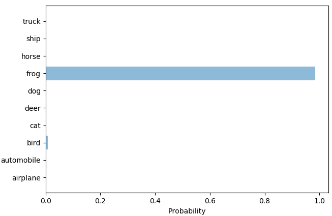

# Object-Detection-using-Convolutional-Neural-Network

Steps to run the project :

Step 1 : Download Cifar10 dataset, training neural net, testing
1) Open Google colaboratory by logging into gmail account
https://colab.research.google.com/notebooks/welcome.ipynb
2) Open new notebook and run the code in model.py file in different cells.
3) Cifar10 dataset is downloaded,trained and tested showing training and validation: accuracy and loss graphs
3) On completely running the file model.py in Google Colab, two files are downloaded- mytrainedmodel_arch.json and mytrainedmodel_weights.h5 which are later used in the file obj_detect.py as inputs.
4) Here, I have already trained the model and downloaded these files.

Step 2 : Image detection and prediction, GUI
1) Open Anaconda Prompt(python 3.6) and change the directory to the above project folder using below command.
cd path-name
2) Run the file obj_detect.py using below command in the prompt.
python obj_detect.py
3) GUI will appear. Choose an image from the folder examples or download any image online from the image classes-airplane, automobile, bird, cat, deer, dog, frog, horse, ship, truck.
4) Probability bar chart will appear predicting the detected image and probable matches(if any) with other image classes.

Important files and folder
Folder- examples
	Contains some downloaded images to be fed to the system.
Files-
1) model.py
	Contains code for downloading cifar10 dataset, training it using Convolutional Neural Network and lastly testing and saving the model. Runned on Google Colab.
2) obj_detect.py
	Contains code to predict the output from the read image. Trained model is fed to the system so that new unknown data is trained on it. Consists code for GUI, reading the image and plotting probability chart.

| Image                                 | Image Probabilities                | Top results                |
|---------------------------------------|------------------------------------|----------------------------|
|    |        | horse, deer                |
|            |        | deer, bird                 |
|           |        | truck, ship, automobile    |
|            |        | frog, bird                 |
